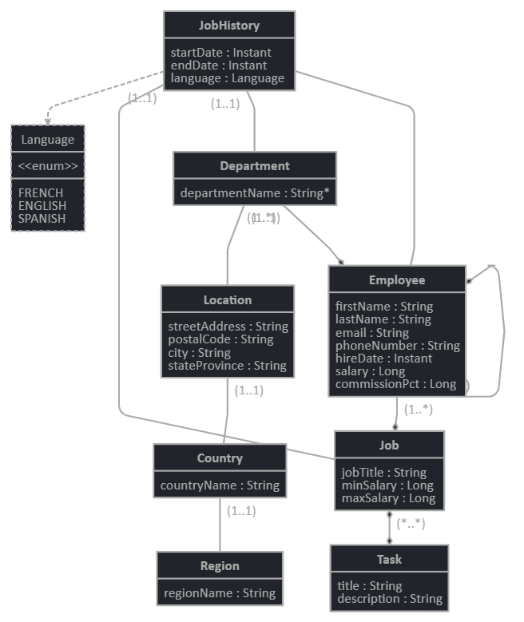

# MySQL Playground for Girlcode Learnership

A simple [Mysql](https://www.mysql.com/) in version 8 to play with data and [PhpMyAdmin](https://www.phpmyadmin.net/) to explore them !

## Installation

You need [Docker]() and [Docker-compose]() to run MySQL and PhpMyAdmin.

If you don't want to use docker, please follow the [MySQL Installation guide](https://dev.mysql.com/doc/refman/8.0/en/installing.html).
You will be able to execute the SQL scripts in `scripts/`

Note: The command lines given in this document are for UNIX-based terminals.

## Usage

Start:

```
docker-compose up
```

MySQL is then available on `localhost:3306` and PhpMyAdmin on http://localhost:8081

Default env variables are set in the `docker-compose.yml`, feel free to change them.

|Variables|Value|
|---|---|
|MYSQL_USER|girlcode|
|MYSQL_PASSWORD|mypassword|
|MYSQL_ROOT_PASSWORD|my_root_password|

Stop: `docker-compose down`

Stop with data deletion: `docker-compose volume down -v`

### PhpMyAdmin

To connect your local database, use the Server: `db` with user and password above.

## Databases

### Authors & posts database

This exported database is a simple one that could represent a blog with only 2 tables:

- `authors`
- `posts`

Authors can write 0 to N posts, representing a One to Many relation materialized by `author_id` in the posts table.

Please note that this database model is very simple and should not be used in production for security reasons.

#### Import

```
docker exec -i mysql-playground-girlcode_db_1 mysql -u girlcode --password=mypassword app_db < ./scripts/1-authors-posts/fulldb22-07-2021.sql
```

### Jobs management system with auth

This exported database is a Job management system with user authentication. It contains random generated data that sometimes doesn't have the right relations and can be considered as 'broken'.

The database model is the following:



Please note that besides this models, you will find tables related to authentication and authorization (with roles):

- `jhi_authority` for defining the roles in the system
- `jhi_user_authority` for giving the roles to user
- `jhi_user` for storing users.

And tables used by Liquibase for upgrading the model that are not relevant for your exercices but show industry best pratices:

- `DATABASECHANGELOG`
- `DATABASECHANGELOGLOCK`

#### Import

```
docker exec -i mysql-playground-girlcode_db_1 mysql -u girlcode --password=mypassword app_db < ./scripts/1-authors-posts/fulldb22-07-2021.sql
```

#### Drop all tables

```
docker exec -i mysql-playground-girlcode_db_1 mysql -u girlcode --password=mypassword app_db < ./scripts/drop-all.sql
```

### Others datasets

- https://southafrica.opendataforafrica.org/
- https://www.reddit.com/r/bigquery/wiki/datasets
- https://data.europa.eu/en
- https://github.com/awesomedata/awesome-public-datasets
